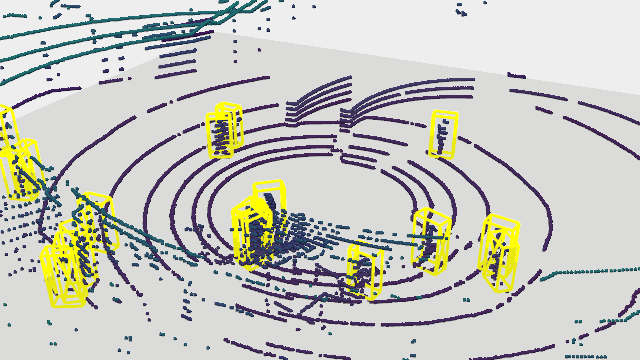
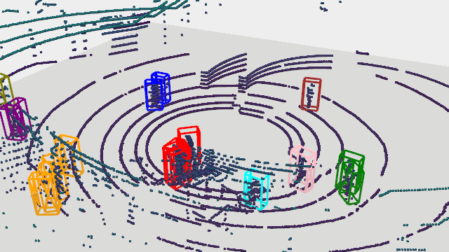

## 3D Group Detection Using Distance-Based Clustering

This page showcases sample outputs from my Master's thesis project on 3D group detection using distance-based clustering (using DBSCAN) applied to LiDAR point cloud data. The full codebase remains private due to a planned academic publication.

### 3D Pedestrian Detection and Group Detection Visualization

<table>
  <tr>
    <td align="center">
      <b>Pedestrian Detection</b> 
      
    </td>
    <td align="center">
      <b>3D Group Detection</b> 
      
    </td>
  </tr>
</table>
