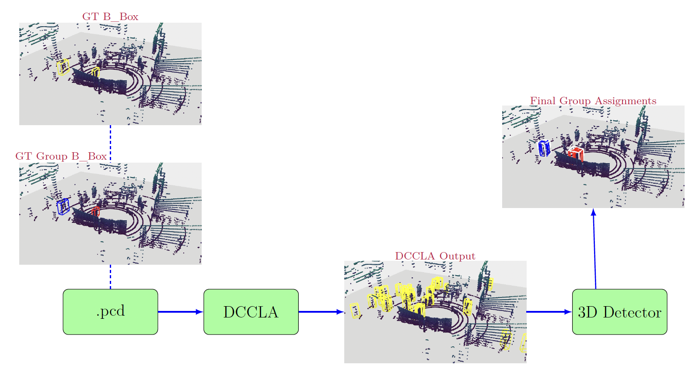

## 3D Group Detection Using Distance-Based Clustering

This page showcases sample outputs from my Master's thesis project on 3D group detection using distance-based clustering (using DBSCAN) applied to LiDAR point cloud data. The full codebase remains private due to a planned academic publication.

### 3D Pedestrian Detection and Group Detection Visualization

<table>
  <tr>
    <td align="center">
      <b>Pedestrian Detection</b> 
      
    </td>
    <td align="center">
      <b>3D Group Detection</b> 
      
    </td>
  </tr>
</table>

---

### 3D Group Detection Pipeline Visualization

  

<b>Figure:</b> End-to-end Visualization of the 3D group detection pipeline for the [DCCLA](https://github.com/jinzhengguang/DCCLA/tree/main) detector on the [L-CAS](https://lcas.lincoln.ac.uk/wp/research/data-sets-software/l-cas-3d-point-cloud-people-dataset/#:~:text=A%20lot%20of%20challenges%20have,people%2C%20and%20crowds%20of%20people) dataset. Ground truth images are aligned vertically on the left. The inference path starts from the point cloud data box (.pcd) at the bottom and flows rightward, ending with final group assignments above the detector output.

